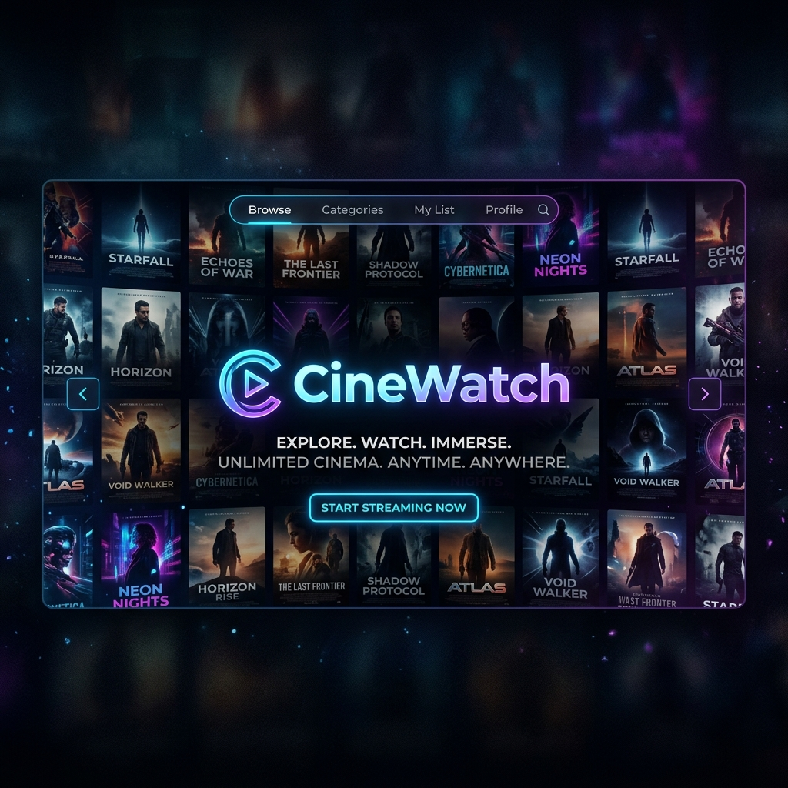

# <p align="center">🎬 CineWatch — The Ultimate Media Streaming Experience</p>

<p align="center">
  
</p>

<p align="center">
  
  
  
  
  
</p>

---

## 🌟 Overview

**CineWatch** is not just another streaming site; it's a meticulously crafted media ecosystem designed for the modern age. Combining the power of **AI automation** with a **premium cinematic interface**, we provide a seamless experience for tracking and watching Movies, TV Series, Anime, and Donghua.

Our mission is to bring the theater experience directly to your browser with unmatched performance and state-of-the-art features.

---

## 🚀 Key Highlights

| Feature | Description |
| :--- | :--- |
| **🤖 AI News Engine** | Automated daily generation of trending movie news and blog posts. |
| **🎧 7.1 Spatial Audio** | Virtual surround sound dashboard for immersive audio calibration. |
| **🔔 Smart Alerts** | Real-time notifications via Telegram & Discord for new releases. |
| **🍱 Hybrid Library** | One-stop destination for Movies, Series, Anime, and Donghua. |
| **📱 Ultra Responsive** | Premium mobile experience with optimized touch controls. |
| **🛡️ Pro Protection** | Built-in anti-inspect and content protection systems. |

---

## 🛠️ System Architecture

CineWatch utilizes a modern distributed architecture to ensure 99.9% uptime and lightning-fast loading speeds:

- **Frontend**: Next.js App Router for server-side rendering and SEO excellence.
- **Data Layer**: Supabase for real-time database synchronization and secure authentication.
- **AI Core**: Specialized LLM integration for link repair analysis and content generation.
- **Edge Network**: Deployed on Vercel's global edge network for minimal latency.

---

## 🍱 Supported Content

- **Movies & TV**: Integration with TMDB for rich metadata and trailers.
- **Anime**: Sync with Anilist to track your favorite seasons and episodes.
- **Donghua**: Specialized players for the growing world of Chinese animation.

---

## 🗺️ Roadmap & Future Plans

- [ ] **v2.0**: Integration of social watch parties.
- [ ] **v2.1**: Native mobile apps (Android & iOS).
- [ ] **v2.2**: AI-driven personalized recommendation engine.
- [ ] **v2.3**: Multi-language subtitle auto-generation.

---

## 📦 Getting Started

### Prerequisites
- Node.js 18.x or higher
- A Supabase Project
- TMDB API Key

### Installation

1. **Clone & Enter:**
   ```bash
   git clone https://github.com/saferill/CineWatch.git
   cd CineWatch
   ```

2. **Install Dependencies:**
   ```bash
   npm install
   ```

3. **Environment Setup:**
   Create a `.env.local` and populate it:
   ```env
   NEXT_PUBLIC_TMDB_API_KEY=your_key
   NEXT_PUBLIC_SUPABASE_URL=your_url
   NEXT_PUBLIC_SUPABASE_ANON_KEY=your_key
   NEXT_PUBLIC_TELEGRAM_BOT_TOKEN=your_bot_token
   NEXT_PUBLIC_TELEGRAM_CHAT_ID=your_chat_id
   ```

4. **Launch:**
   ```bash
   npm run dev
   ```

---

## 🤝 Contributing

We welcome contributions! If you have ideas to make CineWatch even better:
1. Fork the Project.
2. Create your Feature Branch (`git checkout -b feature/AmazingFeature`).
3. Commit your Changes (`git commit -m 'Add some AmazingFeature'`).
4. Push to the Branch (`git push origin feature/AmazingFeature`).
5. Open a Pull Request.

---

## 📜 License

Distributed under the **MIT License**. See `LICENSE` for more information.

---

## 📞 Contact

**Syaf** - [@Syafril123](https://t.me/Syafril123) - Project Lead

Project Link: [https://github.com/saferill/CineWatch](https://github.com/saferill/CineWatch)

---

<p align="center">
  
  
  
</p>

<p align="center">
  <b>© 2026 CineWatch Ecosystem. All Rights Reserved.</b>
</p>
