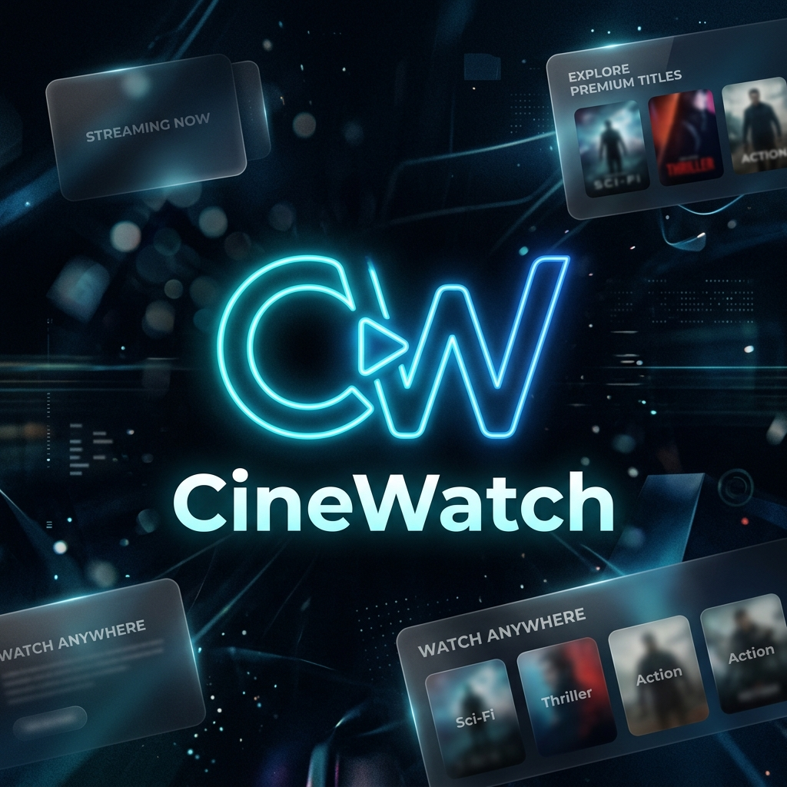

<div align="center">
  
  
  <br />
  <br />

  <h1>🎬 CineWatch</h1>
  
  <p>
    <strong>A Premium Streaming Platform for Movies, TV Shows, Anime, and Donghua</strong>
  </p>

  <p>
    <a href="https://github.com/saferill/CineWatch/stargazers"></a>
    <a href="https://github.com/saferill/CineWatch/network/members"></a>
    <a href="https://nextjs.org/"></a>
    <a href="https://tailwindcss.com/"></a>
  </p>
</div>

<hr />

## 🌟 Introduction

**CineWatch** is a beautifully crafted, modern streaming platform built to provide an unparalleled viewing experience. Designed with a premium, sleek user interface, it allows users to effortlessly discover, track, and watch their favorite movies, television series, anime, and now **Donghua**.

With lightning-fast performance powered by Next.js 16 (App Router), cinematic animations via Framer Motion, and seamless API integrations, CineWatch delivers a distraction-free entertainment hub right to your screen.

## ✨ Key Features

- **🎥 Unlimited Streaming** — Watch movies, TV series, and anime instantly using multiple high-quality streaming providers (VidSrc & OnlyFlix integration).
- **🏮 Dedicated Donghua Section** — Explore a vast collection of Chinese animation with dedicated streaming servers and real-time updates.
- **🔍 Premium Cinematic Search** — Experience a high-end "Spotlight" style search with a 3-column cinematic gallery, live previews, and instant categorization.
- **🎨 Elite UI/UX** — Enjoy a responsive, dark-mode optimized interface with advanced glassmorphism effects, cinematic carousels, and smooth micro-animations.
- **📱 Mobile-First Netflix UI** — Implements a native app-like experience with a bottom navigation bar, dynamic responsive hero sliders, and optimized trailer viewing.
- **🛡️ Anti-Inspect Security** — Advanced protection system that secures the application source and prevents unauthorized developer tool access.
- **🚀 Progressive Web App (PWA)** — Installable directly to your home screen with custom splash screens and seamless offline-ready capabilities.
- **📚 Watch History & Tracking** — Keep track of what you've watched, manage your watchlist, and pick up right where you left off.

## 🛠️ Tech Stack

CineWatch leverages modern web technologies for maximum performance and developer experience:

- **Framework:** [Next.js 16](https://nextjs.org/) (App Router)
- **Language:** [TypeScript](https://www.typescriptlang.org/)
- **Styling:** [Tailwind CSS v4](https://tailwindcss.com/) & [Framer Motion](https://www.framer.com/motion/)
- **Data Sources:** 
  - [TMDB API](https://www.themoviedb.org/api) (Movies & TV Shows)
  - [Anilist API](https://anilist.co/api/v2/) (Anime Metadata)
  - [Moli Provider](https://moli.my.id/) (Donghua Streaming)
- **Deployment:** [Vercel](https://vercel.com/)

## 🚀 Getting Started

Follow these steps to set up CineWatch locally on your machine.

### Prerequisites
- Node.js 18.17 or later
- pnpm (recommended package manager)

### Installation

1. **Clone the repository**
   ```bash
   git clone https://github.com/saferill/CineWatch.git
   cd CineWatch
   ```

2. **Install dependencies**
   ```bash
   pnpm install
   ```

3. **Set up Environment Variables**
   Create a `.env.local` file in the root directory:
   ```env
   # TMDB Configuration
   TMDB_API_KEY=your_tmdb_api_key_here
   
   # Donghua Configuration
   NEXT_PUBLIC_DONGHUA_API=https://api.moli.my.id/
   ```

4. **Run the development server**
   ```bash
   pnpm dev
   ```

## 📄 License

Distributed under the MIT License. See `LICENSE` for more information.

---
<div align="center">
  <i>Developed with ❤️ for the Cinema Community.</i>
</div>